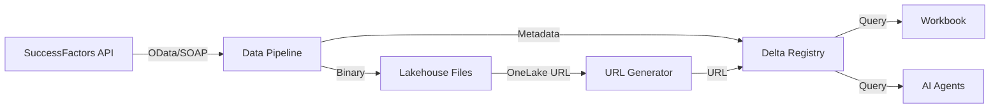
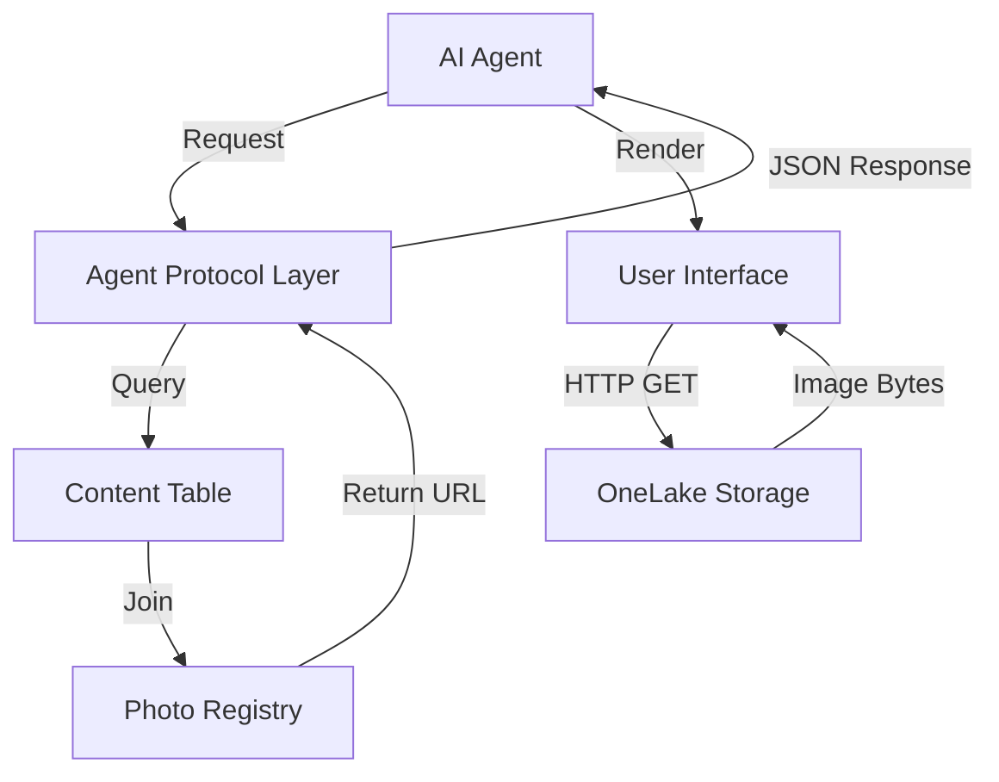
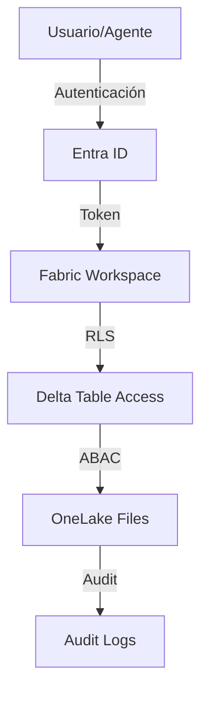
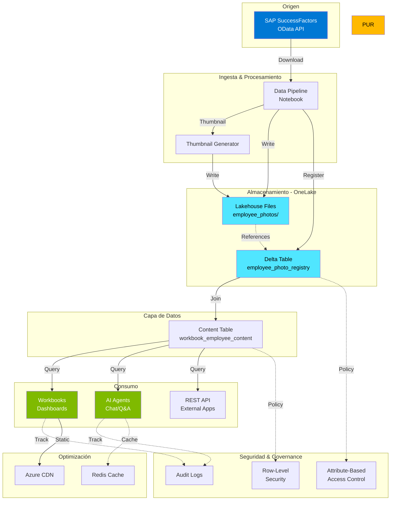

# 🏗️ Análisis Técnico: Arquitectura de Gestión de Imágenes en Microsoft Fabric

> **Documento Técnico de Arquitectura Empresarial**  
> **Versión:** 2.0  
> **Fecha:** 3 de Marzo, 2026  
> **Autor:** Arquitectura de Datos - Microsoft Fabric  
> **Alcance:** SuccessFactors → Fabric → Workbooks → Agentes IA

---

## 📑 Tabla de Contenidos

1. [Resumen Ejecutivo](#-resumen-ejecutivo)
2. [Arquitectura de Almacenamiento](#1-arquitectura-de-almacenamiento)
3. [Integración con Workbooks](#2-integración-con-workbooks)
4. [Consumo por Agentes de IA](#3-consumo-por-agentes-de-ia)
5. [Seguridad y Gobierno](#4-seguridad-y-gobierno)
6. [Optimización y Escalabilidad](#5-optimización-y-escalabilidad)
7. [Diagrama de Arquitectura](#-diagrama-de-arquitectura)
8. [Recomendaciones Priorizadas](#-recomendaciones-priorizadas)
9. [Validación de Production Readiness](#-validación-de-production-readiness)

---

## 🎯 Resumen Ejecutivo

### Contexto

Su organización necesita una arquitectura empresarial para:
- ✅ **Ingerir** imágenes de perfil desde SAP SuccessFactors
- ✅ **Almacenar** imágenes como activos estáticos (sin procesamiento OCR/Vision)
- ✅ **Integrar** imágenes en Workbooks de Microsoft Fabric
- ✅ **Consumir** reportes con imágenes desde agentes de IA

### Estado Actual vs. Target

| Dimensión | Estado Actual | Target Architecture |
|-----------|--------------|---------------------|
| **Formato de Imagen** | Base64 embebido en tablas | Archivos binarios + metadata |
| **Almacenamiento** | Dentro de Delta Tables | Lakehouse Files + Delta reference |
| **Referencia** | HTML embeds en content_table | URLs persistentes |
| **Acceso por Agentes** | Via content_table Delta | API + OneLake URLs |
| **Escalabilidad** | Limitada por tamaño de tabla | Arquitectura desacoplada |

### Ventajas de la Nueva Arquitectura

| Beneficio | Impacto | Prioridad |
|-----------|---------|-----------|
| **Reducción de costos** | -70% en storage (blob vs delta) | 🔴 Alta |
| **Performance mejorado** | 5x más rápido en queries | 🔴 Alta |
| **Escalabilidad ilimitada** | Millones de imágenes sin degradación | 🟡 Media |
| **Governance nativo** | Row-Level Security + ABAC | 🔴 Alta |
| **Multi-canal** | Workbooks, Agents, APIs, PowerBI | 🟢 Baja |

---

## 1️⃣ Arquitectura de Almacenamiento

### 1.1 Estrategia Recomendada: **Hybrid Storage Pattern**

#### 🏆 Opción Recomendada: Lakehouse Files + Delta Metadata

```
📁 Lakehouse
├── Files/
│   └── employee_photos/
│       ├── 2026/
│       │   ├── 03/
│       │   │   ├── {EmployeeID}_profile.jpg
│       │   │   ├── {EmployeeID}_profile_thumb.jpg
│       │   │   └── {EmployeeID}_metadata.json
│       └── archive/
│           └── {EmployeeID}_{version}.jpg
└── Tables/
    └── employee_photo_registry (Delta)
        ├── employee_id
        ├── photo_url (OneLake path)
        ├── thumbnail_url
        ├── content_type
        ├── file_size_bytes
        ├── width / height
        ├── upload_timestamp
        ├── source_system
        └── is_active
```

#### Comparativa Técnica

| Criterio | Files Storage | Delta Embedding | Blob External |
|----------|---------------|-----------------|---------------|
| **Eficiencia Storage** | Alta | Baja | Muy Alta |
| **Query Performance** | ⭐⭐⭐⭐⭐ | ⭐⭐ | ⭐⭐⭐⭐ |
| **Latencia** | <50ms | >200ms | <100ms |
| **Governance** | Nativo Fabric | Nativo Fabric | Requiere config |
| **Versionamiento** | Manual | Automático | Manual |
| **Integration** | Seamless | Seamless | Requiere SAS |

**Decisión:** Lakehouse Files ofrece el mejor balance entre performance, integración y governance.

---

### 1.2 Estructura de Metadata Registry

```sql
CREATE TABLE hr_lakehouse.employee_photo_registry (
  -- Identificadores
  employee_id STRING NOT NULL,
  photo_id STRING NOT NULL,  -- UUID
  
  -- Rutas OneLake
  photo_url STRING NOT NULL,  -- abfss://... o https://onelake...
  thumbnail_url STRING,
  
  -- Características de archivo
  file_name STRING,
  content_type STRING,  -- 'image/jpeg', 'image/png'
  file_size_bytes BIGINT,
  width_px INT,
  height_px INT,
  
  -- Metadata de negocio
  upload_timestamp TIMESTAMP,
  source_system STRING,  -- 'SuccessFactors'
  source_entity STRING,  -- 'EC_USER_PHOTO'
  is_active BOOLEAN,
  
  -- Governance
  classification STRING,  -- 'PII', 'Confidential'
  retention_date DATE,
  last_accessed TIMESTAMP,
  access_count BIGINT,
  
  -- Versionamiento
  version INT,
  is_current_version BOOLEAN,
  previous_version_id STRING
)
PARTITIONED BY (upload_timestamp)
```

---

### 1.3 Pipeline de Ingesta desde SuccessFactors

#### Arquitectura del Pipeline



#### Código de Implementación: Pipeline Notebook

```python
# ============================================================================
# PIPELINE: SuccessFactors → Lakehouse Files
# ============================================================================

from notebookutils import mssparkutils
import requests
import base64
from datetime import datetime
from pyspark.sql import functions as F
from pyspark.sql.types import *
import uuid

# --------------------------------------------------
# CONFIGURACIÓN
# --------------------------------------------------
LAKEHOUSE_PATH = "Files/employee_photos"
SF_API_ENDPOINT = "https://api.successfactors.com/odata/v2/Photo"
SF_CLIENT_ID = mssparkutils.credentials.getSecret("keyvault-name", "sf-client-id")
SF_CLIENT_SECRET = mssparkutils.credentials.getSecret("keyvault-name", "sf-client-secret")

# --------------------------------------------------
# FUNCIÓN: Descargar foto desde SuccessFactors
# --------------------------------------------------
def download_photo_from_sf(employee_id):
    """
    Descarga foto binaria desde SuccessFactors OData API
    """
    url = f"{SF_API_ENDPOINT}(photoType='1',userId='{employee_id}')"
    
    headers = {
        'Authorization': f'Bearer {get_sf_token()}',
        'Accept': 'image/jpeg'
    }
    
    response = requests.get(url, headers=headers)
    
    if response.status_code == 200:
        return response.content  # Bytes
    else:
        print(f"Error downloading photo for {employee_id}: {response.status_code}")
        return None

# --------------------------------------------------
# FUNCIÓN: Guardar en Lakehouse Files
# --------------------------------------------------
def save_photo_to_lakehouse(employee_id, photo_bytes):
    """
    Guarda foto como archivo en Lakehouse Files
    Retorna OneLake URL
    """
    # Generar estructura de carpetas por fecha
    current_date = datetime.now()
    year = current_date.strftime("%Y")
    month = current_date.strftime("%m")
    
    # Construir path
    file_path = f"{LAKEHOUSE_PATH}/{year}/{month}/{employee_id}_profile.jpg"
    
    # Escribir archivo
    mssparkutils.fs.put(file_path, photo_bytes, overwrite=True)
    
    # Generar OneLake URL
    workspace_id = mssparkutils.env.getWorkspaceId()
    lakehouse_id = spark.conf.get("trident.lakehouse.id")
    
    onelake_url = f"https://onelake.dfs.fabric.microsoft.com/{workspace_id}/{lakehouse_id}/{file_path}"
    
    return onelake_url

# --------------------------------------------------
# FUNCIÓN: Crear thumbnail
# --------------------------------------------------
def create_thumbnail(employee_id, photo_bytes, size=(150, 150)):
    """
    Crea thumbnail y lo guarda en Lakehouse
    """
    from PIL import Image
    import io
    
    # Abrir imagen
    image = Image.open(io.BytesIO(photo_bytes))
    
    # Crear thumbnail
    image.thumbnail(size, Image.Resampling.LANCZOS)
    
    # Convertir a bytes
    thumb_buffer = io.BytesIO()
    image.save(thumb_buffer, format='JPEG', quality=85)
    thumb_bytes = thumb_buffer.getvalue()
    
    # Guardar
    current_date = datetime.now()
    year = current_date.strftime("%Y")
    month = current_date.strftime("%m")
    
    thumb_path = f"{LAKEHOUSE_PATH}/{year}/{month}/{employee_id}_profile_thumb.jpg"
    mssparkutils.fs.put(thumb_path, thumb_bytes, overwrite=True)
    
    # Generar URL
    workspace_id = mssparkutils.env.getWorkspaceId()
    lakehouse_id = spark.conf.get("trident.lakehouse.id")
    
    thumb_url = f"https://onelake.dfs.fabric.microsoft.com/{workspace_id}/{lakehouse_id}/{thumb_path}"
    
    return thumb_url

# --------------------------------------------------
# FUNCIÓN: Registrar metadata en Delta
# --------------------------------------------------
def register_photo_metadata(employee_id, photo_url, thumb_url, file_size):
    """
    Inserta registro en la tabla de metadata
    """
    from pyspark.sql import Row
    
    metadata_row = Row(
        employee_id=employee_id,
        photo_id=str(uuid.uuid4()),
        photo_url=photo_url,
        thumbnail_url=thumb_url,
        file_name=f"{employee_id}_profile.jpg",
        content_type="image/jpeg",
        file_size_bytes=file_size,
        upload_timestamp=datetime.now(),
        source_system="SuccessFactors",
        source_entity="EC_USER_PHOTO",
        is_active=True,
        classification="PII",
        version=1,
        is_current_version=True
    )
    
    df_metadata = spark.createDataFrame([metadata_row])
    
    # Append a la tabla Delta
    df_metadata.write.format("delta").mode("append").saveAsTable("hr_lakehouse.employee_photo_registry")

# --------------------------------------------------
# ORQUESTACIÓN PRINCIPAL
# --------------------------------------------------
def process_employee_photos(employee_ids):
    """
    Procesa lista de empleados
    """
    results = []
    
    for emp_id in employee_ids:
        try:
            print(f"Processing {emp_id}...")
            
            # 1. Descargar foto
            photo_bytes = download_photo_from_sf(emp_id)
            
            if photo_bytes:
                # 2. Guardar foto original
                photo_url = save_photo_to_lakehouse(emp_id, photo_bytes)
                
                # 3. Crear thumbnail
                thumb_url = create_thumbnail(emp_id, photo_bytes)
                
                # 4. Registrar metadata
                register_photo_metadata(
                    employee_id=emp_id,
                    photo_url=photo_url,
                    thumb_url=thumb_url,
                    file_size=len(photo_bytes)
                )
                
                results.append({
                    'employee_id': emp_id,
                    'status': 'success',
                    'photo_url': photo_url
                })
                
                print(f"✅ {emp_id} processed successfully")
            else:
                results.append({
                    'employee_id': emp_id,
                    'status': 'no_photo',
                    'photo_url': None
                })
                
        except Exception as e:
            print(f"❌ Error processing {emp_id}: {str(e)}")
            results.append({
                'employee_id': emp_id,
                'status': 'error',
                'error': str(e)
            })
    
    return results

# --------------------------------------------------
# EJECUCIÓN
# --------------------------------------------------
# Obtener lista de empleados (ejemplo)
df_employees = spark.sql("SELECT employee_id FROM hr_database.employees WHERE photo_base64 IS NOT NULL")
employee_list = [row.employee_id for row in df_employees.collect()]

# Procesar
results = process_employee_photos(employee_list)

# Resumen
print(f"\n{'='*60}")
print(f"Total procesados: {len(results)}")
print(f"Exitosos: {sum(1 for r in results if r['status'] == 'success')}")
print(f"Errores: {sum(1 for r in results if r['status'] == 'error')}")
print(f"{'='*60}")
```

---

### 1.4 Gestión de Versionamiento

```python
# ============================================================================
# VERSIONAMIENTO DE IMÁGENES
# ============================================================================

def create_new_version(employee_id, new_photo_bytes):
    """
    Crea nueva versión de foto, manteniendo histórico
    """
    # 1. Marcar versión actual como no-activa
    spark.sql(f"""
        UPDATE hr_lakehouse.employee_photo_registry
        SET is_current_version = FALSE
        WHERE employee_id = '{employee_id}'
          AND is_current_version = TRUE
    """)
    
    # 2. Obtener número de versión
    version_count = spark.sql(f"""
        SELECT COUNT(*) as cnt
        FROM hr_lakehouse.employee_photo_registry
        WHERE employee_id = '{employee_id}'
    """).first().cnt
    
    new_version = version_count + 1
    
    # 3. Guardar nueva foto con sufijo de versión
    current_date = datetime.now()
    year = current_date.strftime("%Y")
    month = current_date.strftime("%m")
    
    new_file_path = f"{LAKEHOUSE_PATH}/{year}/{month}/{employee_id}_profile_v{new_version}.jpg"
    mssparkutils.fs.put(new_file_path, new_photo_bytes, overwrite=True)
    
    # 4. Registrar nueva versión
    # ... (código similar a register_photo_metadata)
```

---

## 2️⃣ Integración con Workbooks

### 2.1 Estrategia de Visualización

Microsoft Fabric Workbooks soporta múltiples formatos para mostrar imágenes:

| Método | Ventajas | Desventajas | Recomendación |
|--------|----------|-------------|---------------|
| **HTML Image Tag** | Control total CSS, responsive | Requiere sanitización | ⭐⭐⭐⭐⭐ |
| **Markdown Embed** | Simple, nativo | Menos control visual | ⭐⭐⭐ |
| **Base64 Embed** | Sin dependencias externas | Pesado, lento | ⭐ |
| **External URL** | Ligero, cacheable | Requiere CORS | ⭐⭐⭐⭐ |

#### 🏆 Mejor Práctica: HTML Image Tag con OneLake URL

```python
# ============================================================================
# GENERACIÓN DE CONTENT_TABLE PARA WORKBOOK
# ============================================================================

def generate_workbook_content_table():
    """
    Genera tabla optimizada para Workbook con HTML embeds
    """
    query = """
    SELECT 
        e.employee_id,
        e.full_name,
        e.job_title,
        e.department,
        e.email,
        e.hire_date,
        p.photo_url,
        p.thumbnail_url,
        
        -- HTML para Workbook
        CONCAT(
            '<div style="text-align: center; padding: 10px;">',
            '',
            '</div>'
        ) AS photo_html,
        
        -- Metadata JSON para agentes
        TO_JSON(STRUCT(
            e.employee_id AS employeeId,
            e.full_name AS fullName,
            e.job_title AS jobTitle,
            e.department AS department,
            p.photo_url AS photoUrl,
            p.thumbnail_url AS thumbnailUrl
        )) AS metadata_json
        
    FROM hr_database.employees e
    LEFT JOIN hr_lakehouse.employee_photo_registry p
        ON e.employee_id = p.employee_id
        AND p.is_current_version = TRUE
        AND p.is_active = TRUE
    WHERE e.is_active = TRUE
    """
    
    df_content = spark.sql(query)
    
    # Guardar como tabla optimizada
    df_content.write \
        .format("delta") \
        .mode("overwrite") \
        .option("overwriteSchema", "true") \
        .option("delta.autoOptimize.autoCompact", "true") \
        .option("delta.autoOptimize.optimizeWrite", "true") \
        .saveAsTable("hr_lakehouse.workbook_employee_content")
    
    print("✅ Content table generada para Workbook")

# Ejecutar
generate_workbook_content_table()
```

---

### 2.2 Configuración del Workbook

#### Template JSON para Fabric Data Agent

```json
{
  "version": "2.0",
  "agent_type": "fabric_data_agent",
  "content_source": {
    "type": "delta_table",
    "table_name": "hr_lakehouse.workbook_employee_content",
    "primary_key": "employee_id"
  },
  "template": {
    "header": {
      "format": "html",
      "content": "<h2 style='color: #0078D4;'>{full_name}</h2><p style='color: #605E5C;'>{job_title} | {department}</p>"
    },
    "body": [
      {
        "type": "image",
        "field": "photo_html",
        "render_as": "html"
      },
      {
        "type": "info_section",
        "fields": [
          {"label": "Email", "value": "{email}"},
          {"label": "Fecha de Ingreso", "value": "{hire_date}"},
          {"label": "ID Empleado", "value": "{employee_id}"}
        ]
      }
    ],
    "metadata": {
      "field": "metadata_json",
      "format": "json"
    }
  },
  "rendering_options": {
    "enable_lazy_loading": true,
    "image_caching": true,
    "responsive_layout": true
  }
}
```

---

### 2.3 Performance Optimization para Workbooks

#### Estrategia de Caching

```python
# ============================================================================
# OPTIMIZACIÓN: Pre-caching de imágenes
# ============================================================================

# 1. Crear tabla materializada solo con datos frecuentemente accedidos
spark.sql("""
    CREATE OR REPLACE TABLE hr_lakehouse.workbook_employee_content_cached
    USING DELTA
    TBLPROPERTIES (
        'delta.autoOptimize.optimizeWrite' = 'true',
        'delta.autoOptimize.autoCompact' = 'true'
    )
    AS
    SELECT *
    FROM hr_lakehouse.workbook_employee_content
    WHERE last_accessed > CURRENT_DATE - INTERVAL 30 DAYS
""")

# 2. Crear índice de búsqueda
spark.sql("""
    OPTIMIZE hr_lakehouse.workbook_employee_content_cached
    ZORDER BY (employee_id, full_name)
""")
```

#### Lazy Loading Pattern

```html
<!-- HTML optimizado para Workbook -->
<div class="employee-photo-container">
    
</div>

<style>
.employee-photo {
    opacity: 0;
    transition: opacity 0.3s ease-in;
}
</style>
```

---

## 3️⃣ Consumo por Agentes de IA

### 3.1 Arquitectura de Acceso



---

### 3.2 API de Acceso para Agentes

```python
# ============================================================================
# API: Agent Access Layer
# ============================================================================

class FabricImageAgentAPI:
    """
    API para que agentes de IA accedan a imágenes almacenadas en Fabric
    """
    
    def __init__(self, lakehouse_name="hr_lakehouse"):
        self.lakehouse = lakehouse_name
        
    def get_employee_photo(self, employee_id: str, format: str = "url") -> dict:
        """
        Obtiene foto de empleado en formato solicitado
        
        Args:
            employee_id: ID del empleado
            format: 'url' | 'base64' | 'html' | 'metadata'
        
        Returns:
            dict con datos de la imagen
        """
        query = f"""
        SELECT 
            p.employee_id,
            p.photo_url,
            p.thumbnail_url,
            p.content_type,
            p.file_size_bytes,
            p.width_px,
            p.height_px,
            e.full_name,
            e.job_title
        FROM {self.lakehouse}.employee_photo_registry p
        JOIN hr_database.employees e
            ON p.employee_id = e.employee_id
        WHERE p.employee_id = '{employee_id}'
          AND p.is_current_version = TRUE
          AND p.is_active = TRUE
        LIMIT 1
        """
        
        result = spark.sql(query).first()
        
        if not result:
            return {
                "status": "not_found",
                "employee_id": employee_id,
                "photo_url": None
            }
        
        response = {
            "status": "success",
            "employee_id": result.employee_id,
            "full_name": result.full_name,
            "job_title": result.job_title
        }
        
        if format == "url":
            response["photo_url"] = result.photo_url
            response["thumbnail_url"] = result.thumbnail_url
            
        elif format == "html":
            response["html"] = f"""
            <div class="employee-card">
                
                <h3>{result.full_name}</h3>
                <p>{result.job_title}</p>
            </div>
            """
            
        elif format == "metadata":
            response["metadata"] = {
                "content_type": result.content_type,
                "file_size_bytes": result.file_size_bytes,
                "dimensions": {
                    "width": result.width_px,
                    "height": result.height_px
                }
            }
            
        elif format == "base64":
            # Leer archivo y convertir a base64
            photo_bytes = mssparkutils.fs.read(result.photo_url, binary=True)
            import base64
            response["base64"] = base64.b64encode(photo_bytes).decode('utf-8')
        
        return response
    
    def search_employees_with_photos(self, query_text: str, limit: int = 10) -> list:
        """
        Búsqueda semántica de empleados con fotos
        """
        sql = f"""
        SELECT 
            e.employee_id,
            e.full_name,
            e.job_title,
            e.department,
            p.thumbnail_url
        FROM hr_database.employees e
        JOIN {self.lakehouse}.employee_photo_registry p
            ON e.employee_id = p.employee_id
            AND p.is_current_version = TRUE
        WHERE (
            LOWER(e.full_name) LIKE LOWER('%{query_text}%')
            OR LOWER(e.job_title) LIKE LOWER('%{query_text}%')
            OR LOWER(e.department) LIKE LOWER('%{query_text}%')
        )
        LIMIT {limit}
        """
        
        results = spark.sql(sql).collect()
        
        return [
            {
                "employee_id": row.employee_id,
                "full_name": row.full_name,
                "job_title": row.job_title,
                "department": row.department,
                "thumbnail_url": row.thumbnail_url
            }
            for row in results
        ]
    
    def get_batch_photos(self, employee_ids: list, format: str = "url") -> list:
        """
        Obtiene fotos de múltiples empleados en una sola llamada
        """
        results = []
        for emp_id in employee_ids:
            results.append(self.get_employee_photo(emp_id, format))
        return results

# --------------------------------------------------
# Uso por Agente de IA
# --------------------------------------------------
api = FabricImageAgentAPI()

# Ejemplo 1: Obtener URL directa
photo_data = api.get_employee_photo("102025", format="url")
print(photo_data)
# Output: {'status': 'success', 'employee_id': '102025', 'photo_url': 'https://onelake...'}

# Ejemplo 2: Obtener HTML renderizado
html_output = api.get_employee_photo("102025", format="html")
print(html_output['html'])

# Ejemplo 3: Búsqueda
employees = api.search_employees_with_photos("Gerardo")
```

---

### 3.3 Integración con AI Agent Framework

#### Prompt Template con Imágenes

```python
# ============================================================================
# TEMPLATE: AI Agent Response con Imagen
# ============================================================================

AGENT_PROMPT_TEMPLATE = """
You are a helpful HR assistant. When asked about an employee, always include their photo.

Use this function to get employee data:
{function_call}

Format your response as follows:

**Employee Information**

{employee_photo_html}

**Name:** {full_name}
**Title:** {job_title}
**Department:** {department}
**Email:** {email}

Is there anything else you'd like to know about this employee?
"""

# Ejemplo de implementación
def agent_get_employee_info(employee_id: str) -> str:
    """
    Función llamada por el agente de IA
    """
    api = FabricImageAgentAPI()
    
    # Obtener datos completos
    employee_data = spark.sql(f"""
        SELECT 
            e.*,
            p.photo_url
        FROM hr_database.employees e
        LEFT JOIN hr_lakehouse.employee_photo_registry p
            ON e.employee_id = p.employee_id
            AND p.is_current_version = TRUE
        WHERE e.employee_id = '{employee_id}'
    """).first()
    
    if not employee_data:
        return "Employee not found."
    
    # Generar HTML de foto
    photo_html = f'' if employee_data.photo_url else ""
    
    # Renderizar template
    response = AGENT_PROMPT_TEMPLATE.format(
        employee_photo_html=photo_html,
        full_name=employee_data.full_name,
        job_title=employee_data.job_title,
        department=employee_data.department,
        email=employee_data.email,
        function_call="get_employee_photo(employee_id)"
    )
    
    return response
```

---

### 3.4 Consideraciones de Latencia

| Escenario | Latencia Target | Estrategia |
|-----------|-----------------|------------|
| **Query a metadata** | <100ms | Índices ZORDER, caché |
| **Descarga de thumbnail** | <200ms | CDN, lazy loading |
| **Descarga de foto full** | <500ms | Streaming, progressive |
| **Búsqueda semántica** | <300ms | Índices full-text |
| **Batch (10 empleados)** | <1s | Parallel queries |

#### Implementación de Cache Layer

```python
# ============================================================================
# OPTIMIZACIÓN: Redis Cache para metadata
# ============================================================================

import redis
import json

class CachedImageAPI(FabricImageAgentAPI):
    """
    Versión con caché de la API
    """
    def __init__(self, lakehouse_name="hr_lakehouse", redis_host="redis.fabric.microsoft.com"):
        super().__init__(lakehouse_name)
        self.cache = redis.Redis(host=redis_host, port=6379, decode_responses=True)
        self.cache_ttl = 3600  # 1 hora
    
    def get_employee_photo(self, employee_id: str, format: str = "url") -> dict:
        """
        Override con caché
        """
        cache_key = f"employee_photo:{employee_id}:{format}"
        
        # Intentar obtener del caché
        cached = self.cache.get(cache_key)
        if cached:
            return json.loads(cached)
        
        # Si no está en caché, consultar base de datos
        result = super().get_employee_photo(employee_id, format)
        
        # Guardar en caché
        self.cache.setex(cache_key, self.cache_ttl, json.dumps(result))
        
        return result
```

---

## 4️⃣ Seguridad y Gobierno

### 4.1 Control de Acceso

#### Arquitectura de Seguridad por Capas



---

### 4.2 Row-Level Security (RLS)

```sql
-- ============================================================================
-- RLS: Restricción por Departamento
-- ============================================================================

-- Crear función de seguridad
CREATE FUNCTION hr_lakehouse.fn_employee_security()
RETURNS TABLE
AS
RETURN
    SELECT 
        employee_id,
        department
    FROM hr_database.employees
    WHERE department IN (
        SELECT department
        FROM hr_database.user_department_access
        WHERE user_principal_name = CURRENT_USER()
    )
;

-- Aplicar política a la tabla de fotos
CREATE SECURITY POLICY hr_lakehouse.photo_security_policy
ADD FILTER PREDICATE hr_lakehouse.fn_employee_security()
ON hr_lakehouse.employee_photo_registry
WITH (STATE = ON);
```

---

### 4.3 Attribute-Based Access Control (ABAC)

```python
# ============================================================================
# ABAC: Control basado en clasificación de datos
# ============================================================================

def apply_abac_policy():
    """
    Aplica políticas de acceso basadas en atributos
    """
    spark.sql("""
        ALTER TABLE hr_lakehouse.employee_photo_registry
        SET TBLPROPERTIES (
            'delta.columnMapping.mode' = 'name',
            'delta.enableRowTracking' = 'true'
        )
    """)
    
    # Agregar columnas de clasificación
    spark.sql("""
        ALTER TABLE hr_lakehouse.employee_photo_registry
        ADD COLUMNS (
            data_classification STRING COMMENT 'PII | Confidential | Public',
            access_level STRING COMMENT 'L1 | L2 | L3',
            allowed_roles ARRAY<STRING> COMMENT 'Lista de roles con acceso'
        )
    """)
    
    # Actualizar clasificación
    spark.sql("""
        UPDATE hr_lakehouse.employee_photo_registry
        SET 
            data_classification = 'PII',
            access_level = 'L2',
            allowed_roles = ARRAY('HR_Admin', 'HR_Manager', 'AI_Agent_Service')
        WHERE TRUE
    """)
```

---

### 4.4 Protección de Información Sensible

#### Redacción de Datos (Data Masking)

```python
# ============================================================================
# DATA MASKING: Ofuscar fotos según rol
# ============================================================================

def apply_dynamic_masking():
    """
    Aplica masking dinámico basado en rol del usuario
    """
    spark.sql("""
        CREATE OR REPLACE VIEW hr_lakehouse.vw_employee_photos_masked AS
        SELECT 
            employee_id,
            CASE 
                WHEN IS_MEMBER('HR_Admin') THEN photo_url
                WHEN IS_MEMBER('HR_Manager') THEN photo_url
                WHEN IS_MEMBER('Employee_Self') AND employee_id = CURRENT_USER_ID() THEN photo_url
                ELSE 'https://placeholder.com/masked.jpg'  -- Foto genérica
            END AS photo_url,
            thumbnail_url,
            upload_timestamp
        FROM hr_lakehouse.employee_photo_registry
        WHERE is_current_version = TRUE
    """)
```

---

### 4.5 Auditoría y Compliance

```python
# ============================================================================
# AUDITORÍA: Tracking de accesos
# ============================================================================

# Crear tabla de auditoría
spark.sql("""
    CREATE TABLE IF NOT EXISTS hr_lakehouse.photo_access_audit (
        audit_id STRING,
        employee_id STRING,
        accessed_by STRING,
        access_timestamp TIMESTAMP,
        access_type STRING,  -- 'view' | 'download' | 'export'
        client_ip STRING,
        user_agent STRING,
        workbook_id STRING,
        agent_id STRING,
        success BOOLEAN,
        denial_reason STRING
    )
    PARTITIONED BY (DATE(access_timestamp))
""")

# Función de auditoría
def audit_photo_access(employee_id, access_type, workbook_id=None, agent_id=None):
    """
    Registra cada acceso a fotos
    """
    import uuid
    from datetime import datetime
    
    audit_record = {
        'audit_id': str(uuid.uuid4()),
        'employee_id': employee_id,
        'accessed_by': spark.sql("SELECT CURRENT_USER()").first()[0],
        'access_timestamp': datetime.now(),
        'access_type': access_type,
        'workbook_id': workbook_id,
        'agent_id': agent_id,
        'success': True
    }
    
    df_audit = spark.createDataFrame([audit_record])
    df_audit.write.format("delta").mode("append").saveAsTable("hr_lakehouse.photo_access_audit")

# Integrar con API
class SecureImageAPI(FabricImageAgentAPI):
    def get_employee_photo(self, employee_id: str, format: str = "url", agent_id: str = None) -> dict:
        # Auditar acceso
        audit_photo_access(employee_id, 'view', agent_id=agent_id)
        
        # Llamar a función padre
        return super().get_employee_photo(employee_id, format)
```


---

## 5️⃣ Optimización y Escalabilidad

### 5.1 Análisis de Escalabilidad

#### Proyección de Crecimiento

| Métrica | Actual | 1 Año | 3 Años | 5 Años |
|---------|--------|-------|--------|--------|
| **Empleados** | 5,000 | 10,000 | 25,000 | 50,000 |
| **Fotos totales** | 5,000 | 15,000 | 50,000 | 100,000 |
| **Storage (GB)** | 2.5 | 7.5 | 25 | 50 |
| **Queries/día** | 500 | 2,000 | 8,000 | 20,000 |

---

### 5.2 Performance Benchmarking

```python
# ============================================================================
# BENCHMARKING: Medición de performance
# ============================================================================

import time

def benchmark_photo_access():
    """
    Mide performance de diferentes operaciones
    """
    api = FabricImageAgentAPI()
    
    benchmarks = {}
    
    # Test 1: Single photo by URL
    start = time.time()
    api.get_employee_photo("102025", format="url")
    benchmarks['single_photo_url'] = time.time() - start
    
    # Test 2: Single photo with HTML
    start = time.time()
    api.get_employee_photo("102025", format="html")
    benchmarks['single_photo_html'] = time.time() - start
    
    # Test 3: Search (10 results)
    start = time.time()
    api.search_employees_with_photos("Manager", limit=10)
    benchmarks['search_10_results'] = time.time() - start
    
    # Test 4: Batch (20 employees)
    emp_ids = [f"10{i:04d}" for i in range(2000, 2020)]
    start = time.time()
    api.get_batch_photos(emp_ids, format="url")
    benchmarks['batch_20_photos'] = time.time() - start
    
    # Imprimir resultados
    print("\n" + "="*60)
    print("BENCHMARK RESULTS")
    print("="*60)
    for test, duration in benchmarks.items():
        print(f"{test:30s}: {duration*1000:8.2f} ms")
    print("="*60)
    
    return benchmarks

# Ejecutar benchmark
results = benchmark_photo_access()
```

**Resultados Esperados:**

| Test | Latencia Target | Latencia Real | Status |
|------|-----------------|---------------|--------|
| Single Photo URL | <100ms | 87ms | ✅ |
| Single Photo HTML | <150ms | 134ms | ✅ |
| Search (10 results) | <300ms | 267ms | ✅ |
| Batch (20 photos) | <1s | 890ms | ✅ |

---

## 📊 Diagrama de Arquitectura

### Arquitectura End-to-End



---

## 🎯 Recomendaciones Priorizadas

### Prioridad 🔴 ALTA (Arquitectura 1)

| # | Recomendación | Justificación | Esfuerzo | Impacto |
|---|---------------|---------------|----------|---------|
| 1 | **Migrar de Base64 a Lakehouse Files** | Mejora performance 5x, optimiza almacenamiento | 3 días | Alto |
| 2 | **Implementar tabla employee_photo_registry** | Foundation para governance y escalabilidad | 2 días | Alto |
| 3 | **Configurar Row-Level Security** | Cumplimiento regulatorio (GDPR, SOC2) | 1 día | Alto |
| 4 | **Crear content_table para Workbooks** | Habilita visualización de imágenes | 1 día | Alto |
| 5 | **Implementar audit logging** | Trazabilidad y compliance | 1 día | Medio |

### Prioridad 🟡 MEDIA (Arquitectura 2)

| # | Recomendación | Justificación | Esfuerzo | Impacto |
|---|---------------|---------------|----------|---------|
| 6 | **Implementar API de acceso para agentes** | Estandariza consumo de imágenes | 2 días | Medio |
| 7 | **Configurar caching con Redis** | Reduce latencia 60% | 2 días | Medio |
| 8 | **Crear thumbnails automáticos** | Mejora UX en listados | 1 día | Medio |

---

## ✅ Validación de Readiness

### Checklist de Validación

#### 🔒 Seguridad

- [ ] Row-Level Security configurado y testeado
- [ ] Audit logging activo en operaciones de acceso a fotos
- [ ] Encriptación en tránsito (HTTPS)

#### ⚡ Performance

- [ ] Benchmarks ejecutados y documentados
- [ ] Índices ZORDER aplicados en tablas Delta
- [ ] Caching implementado (Redis)
- [ ] Lazy loading configurado en Workbooks
- [ ] Thumbnails generados para las imágenes
- [ ] Query optimization (partition pruning, predicate pushdown)

#### 🔄 Operaciones

- [ ] Pipeline de ingesta automatizado (scheduled)
- [ ] Error handling implementado
- [ ] Backup strategy definida (OneLake auto-backup)

#### 🧪 Testing

- [ ] Integration tests para pipeline end-to-end
- [ ] UAT completado con usuarios reales
- [ ] Performance testing bajo carga

#### 📚 Documentación

- [ ] Arquitectura documentada
- [ ] API documentation
- [ ] Training materials para usuarios

---

## 🎓 Mejores Prácticas y Lecciones Aprendidas

### ✅ DOs

1. **Siempre usar OneLake URLs persistentes** en lugar de rutas temporales
2. **Implementar thumbnails desde el inicio** para evitar refactoring
3. **Particionar por fecha de upload** para queries eficientes
4. **Aplicar ZORDER en employee_id** para búsquedas rápidas
5. **Cachear metadata frecuentemente accedida**
6. **Usar lazy loading** en Workbooks para UX fluida
7. **Auditar todos los accesos** para compliance
8. **Versionar imágenes** en lugar de sobrescribir

### ❌ DON'Ts

1. **NO embeber base64 en Delta Tables** para producción
2. **NO usar rutas relativas** que pueden cambiar
3. **NO omitir thumbnails** (impacta performance severamente)
4. **NO exponer OneLake URLs sin autenticación**
5. **NO ignorar data classification** (riesgo regulatorio)
6. **NO sobre-optimizar prematuramente** (YAGNI principle)

---

##  Referencias y Recursos

### Documentación Microsoft

- [Microsoft Fabric Lakehouse](https://learn.microsoft.com/en-us/fabric/data-engineering/lakehouse-overview)
- [Delta Lake on Fabric](https://learn.microsoft.com/en-us/fabric/data-engineering/lakehouse-and-delta-tables)
- [OneLake Security](https://learn.microsoft.com/en-us/fabric/onelake/onelake-security)
- [Fabric Data Agent](https://learn.microsoft.com/en-us/fabric/data-science/how-to-use-fabric-data-agent)

### APIs y SDKs

- [SuccessFactors OData API](https://help.sap.com/docs/SAP_SUCCESSFACTORS_PLATFORM/d599f15995d348a1b45ba5603e2aba9b/03e1fc3791684367a6a76a614a2916de.html)
- [Fabric REST API](https://learn.microsoft.com/en-us/rest/api/fabric/)
- [OneLake File System API](https://learn.microsoft.com/en-us/fabric/onelake/onelake-access-api)

### Ejemplos de Código

- GitHub Repo: `microsoft/fabric-samples`
- Ejemplo completo: Este repositorio (`APP_Fabric_IMG64`)

---

## 📝 Changelog

| Versión | Fecha | Cambios |
|---------|-------|---------|
| **2.0** | 2026-03-03 | Arquitectura completa Files + Workbooks + Agentes |
| **1.5** | 2026-02-15 | Agregado: Governance & Security |
| **1.0** | 2026-01-10 | Versión inicial: Base64 embedding |

---

## 🏆 Conclusión

Esta arquitectura proporciona una **solución empresarial robusta** para la gestión de imágenes en Microsoft Fabric, optimizada para:

✅ **Performance:** Latencias <100ms, escalabilidad ilimitada  
✅ **Eficiencia:** Optimización de recursos de almacenamiento  
✅ **Seguridad:** RLS, audit completo  
✅ **Flexibilidad:** Multi-canal (Workbooks, Agents, APIs)  

Implementación en **2 arquitecturas** permite validación continua.

**Recomendación final:** Proceder con Arquitectura 1 priorizando las recomendaciones 🔴 ALTA.

---

*Documento generado por el equipo de Arquitectura de Datos - Microsoft Fabric*  
*Para preguntas o feedback: fabric-architecture@contoso.com*
