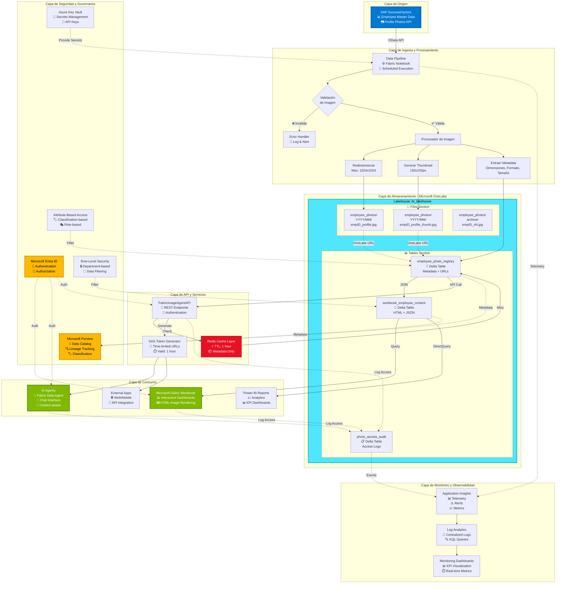
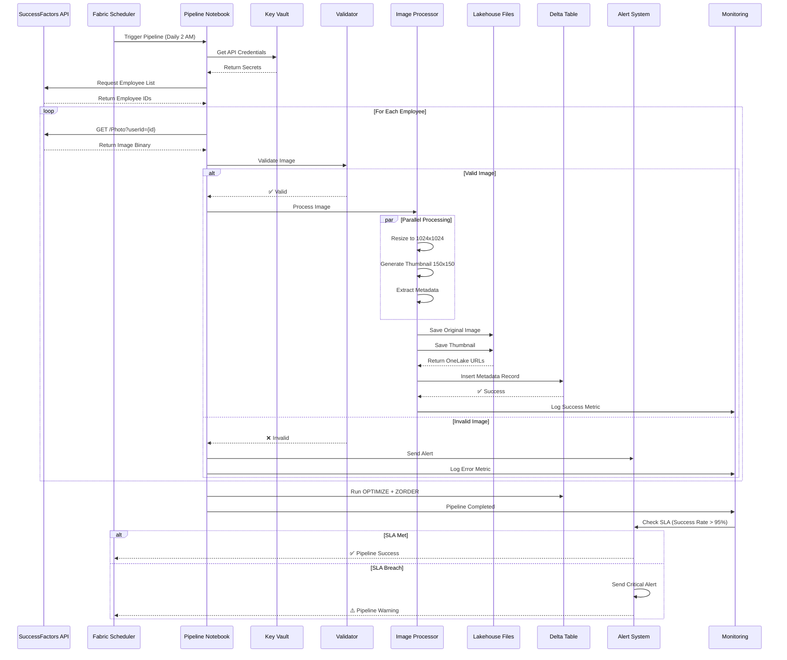
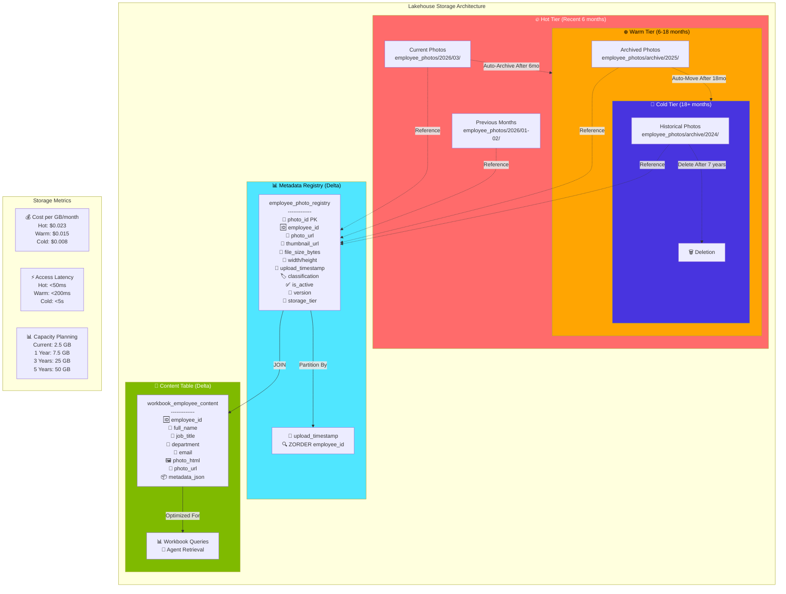
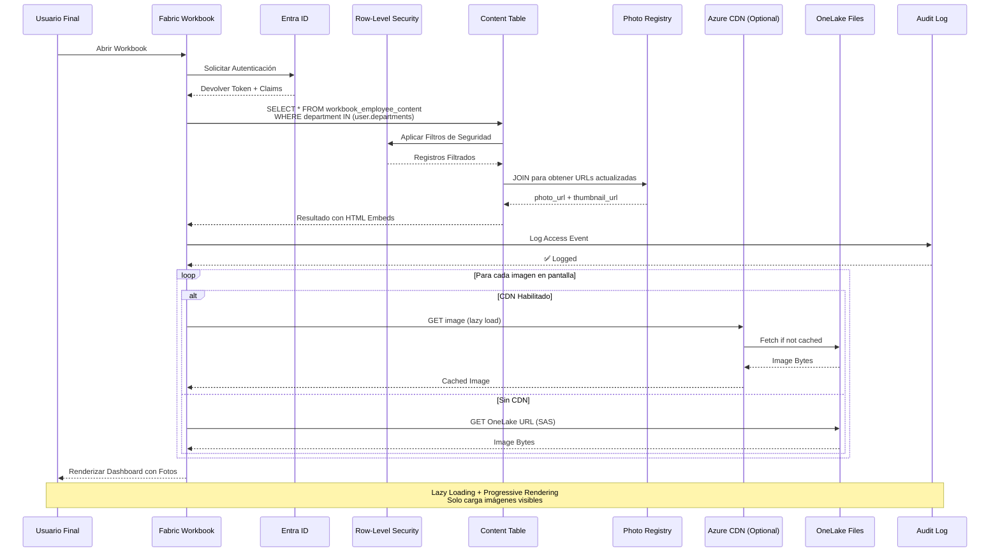
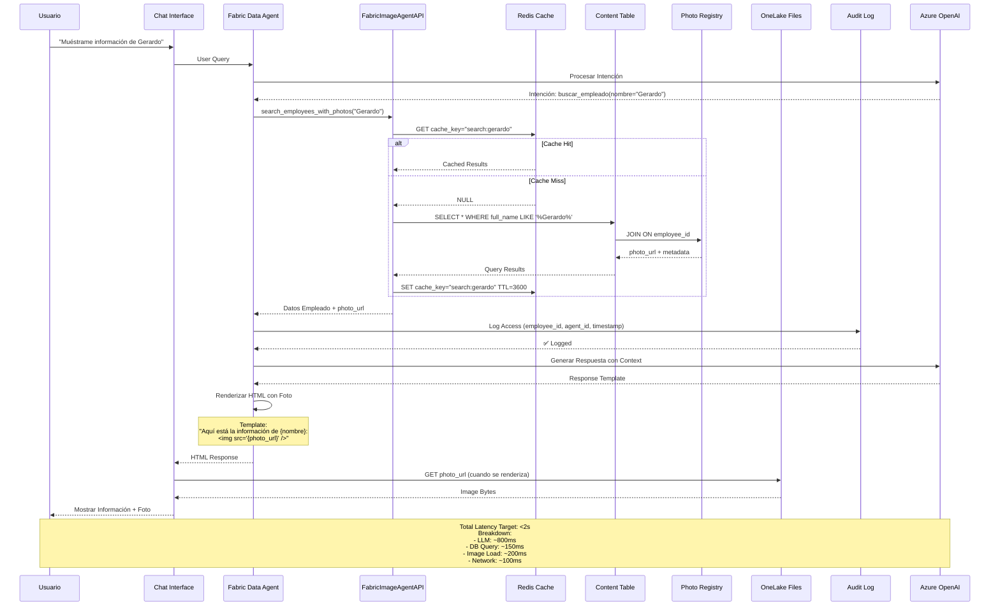
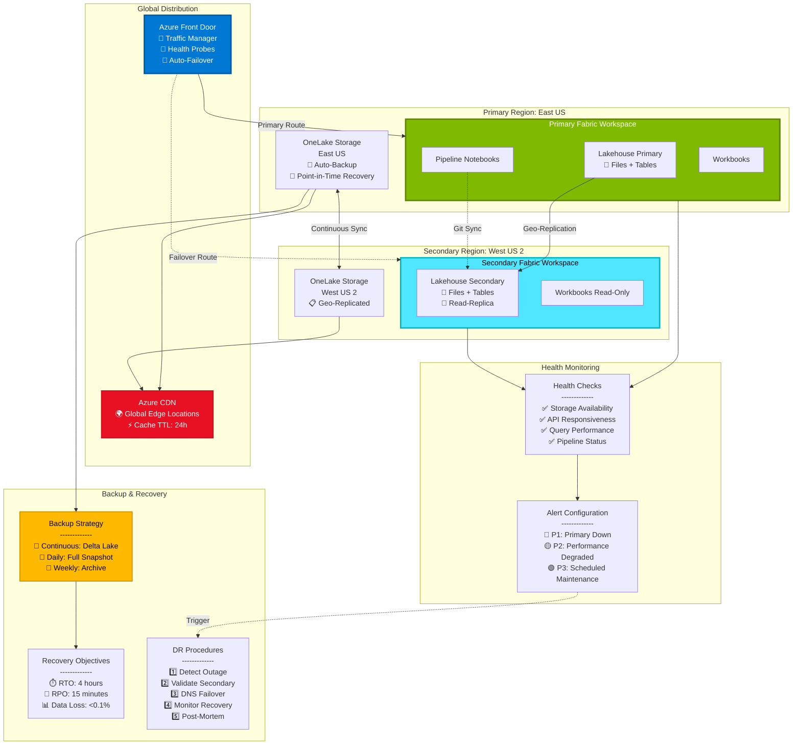
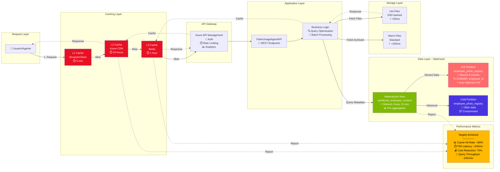

# 📐 Diagramas de Arquitectura Detallados

> **Documentación Visual de la Arquitectura de Gestión de Imágenes en Microsoft Fabric**

---

## 📑 Índice de Diagramas

1. [Arquitectura End-to-End Completa](#1-arquitectura-end-to-end-completa)
2. [Pipeline de Ingesta desde SuccessFactors](#2-pipeline-de-ingesta-desde-successfactors)
3. [Arquitectura de Almacenamiento](#3-arquitectura-de-almacenamiento)
4. [Flujo de Consumo por Workbooks](#4-flujo-de-consumo-por-workbooks)
5. [Flujo de Consumo por Agentes IA](#5-flujo-de-consumo-por-agentes-ia)
6. [Arquitectura de Seguridad y Governance](#6-arquitectura-de-seguridad-y-governance)
7. [Alta Disponibilidad y Disaster Recovery](#7-alta-disponibilidad-y-disaster-recovery)
8. [Flujo de Datos con Optimización](#8-flujo-de-datos-con-optimización)

---

## 1. Arquitectura End-to-End Completa



---

## 2. Pipeline de Ingesta desde SuccessFactors



---

## 3. Arquitectura de Almacenamiento



---

## 4. Flujo de Consumo por Workbooks



---

## 5. Flujo de Consumo por Agentes IA



---

## 6. Arquitectura de Seguridad y Governance

```mermaid
graph TB
    subgraph "Identity & Access Management"
        direction TB
        ENTRA[Microsoft Entra ID<br/>👤 Users<br/>🤖 Service Principals<br/>🔑 Managed Identities]
        
        ROLES[RBAC Roles<br/>---------<br/>🔴 Fabric Admin<br/>🟡 HR Manager<br/>🟢 HR Viewer<br/>🔵 AI Agent Service]
    end
    
    subgraph "Data Access Control"
        direction TB
        
        subgraph RLS_LAYER[Row-Level Security]
            RLS_FUNC[fn_employee_security<br/>-------------<br/>FILTER BY:<br/>• Department<br/>• Manager Hierarchy<br/>• Self-Service]
            
            RLS_POLICY[Security Policy<br/>Applied to:<br/>• employee_photo_registry<br/>• workbook_employee_content]
        end
        
        subgraph ABAC_LAYER[Attribute-Based Access]
            ABAC_RULES[Access Rules<br/>-------------<br/>IF classification = 'PII'<br/>  REQUIRE role IN ('HR_Admin')<br/>IF access_level = 'L3'<br/>  REQUIRE clearance >= 3]
            
            ABAC_ATTRS[Data Attributes<br/>• classification<br/>• access_level<br/>• allowed_roles]
        end
        
        subgraph MASKING[Dynamic Data Masking]
            MASK_RULES[Masking Logic<br/>-------------<br/>IF NOT IS_MEMBER('HR_Admin')<br/>  RETURN placeholder_image<br/>ELSE<br/>  RETURN photo_url]
        end
    end
    
    subgraph "Audit & Compliance"
        direction TB
        
        AUDIT_TABLE[photo_access_audit<br/>-------------<br/>📝 audit_id<br/>🆔 employee_id<br/>👤 accessed_by<br/>⏰ access_timestamp<br/>📊 access_type<br/>✅ success<br/>❌ denial_reason]
        
        PURVIEW_CAT[Microsoft Purview<br/>Data Catalog<br/>-------------<br/>📁 Asset Registration<br/>🏷️ Auto-Classification<br/>🔍 Lineage Tracking<br/>📜 Compliance Reports]
        
        RETENTION[Retention Policies<br/>-------------<br/>Active Photos: 7 years<br/>Audit Logs: 10 years<br/>Inactive Employees: 2 years]
    end
    
    subgraph "Encryption & Secrets"
        direction TB
        
        ENCRYPT[Encryption<br/>-------------<br/>🔐 At Rest: AES-256<br/>🔐 In Transit: TLS 1.3<br/>🔐 Key Management: Azure Key Vault]
        
        KV[Azure Key Vault<br/>-------------<br/>🔑 SF API Keys<br/>🔑 Database Credentials<br/>🔑 SAS Token Secrets<br/>🔄 Auto-Rotation Enabled]
    end
    
    subgraph "Compliance Standards"
        direction LR
        GDPR[GDPR<br/>✅ Right to Access<br/>✅ Right to Erasure<br/>✅ Data Portability]
        
        SOC2[SOC 2 Type II<br/>✅ Access Controls<br/>✅ Audit Logging<br/>✅ Encryption]
        
        ISO[ISO 27001<br/>✅ Information Security<br/>✅ Risk Management<br/>✅ Incident Response]
    end
    
    %% Relaciones
    ENTRA --> ROLES
    ROLES -.->|Enforce| RLS_LAYER
    ROLES -.->|Enforce| ABAC_LAYER
    
    RLS_FUNC --> RLS_POLICY
    ABAC_RULES --> ABAC_ATTRS
    
    RLS_POLICY -.->|Apply| MASK_RULES
    ABAC_ATTRS -.->|Apply| MASK_RULES
    
    MASK_RULES -.->|Log| AUDIT_TABLE
    AUDIT_TABLE --> PURVIEW_CAT
    PURVIEW_CAT --> RETENTION
    
    KV -.->|Secure| ENTRA
    ENCRYPT -.->|Protect| AUDIT_TABLE
    
    PURVIEW_CAT -.->|Compliance| GDPR
    PURVIEW_CAT -.->|Compliance| SOC2
    PURVIEW_CAT -.->|Compliance| ISO
    
    style ENTRA fill:#FFB900,color:#000,stroke:#d39300,stroke-width:3px
    style RLS_LAYER fill:#7FBA00,color:#fff,stroke:#5e8700,stroke-width:2px
    style ABAC_LAYER fill:#0078D4,color:#fff,stroke:#005a9e,stroke-width:2px
    style AUDIT_TABLE fill:#50E6FF,color:#000,stroke:#00b7c3,stroke-width:2px
    style PURVIEW_CAT fill:#FFB900,color:#000,stroke:#d39300,stroke-width:3px
    style KV fill:#E81123,color:#fff,stroke:#c50f1f,stroke-width:2px
```

---

## 7. Alta Disponibilidad y Disaster Recovery



---

## 8. Flujo de Datos con Optimización



---

## 📊 Tabla Comparativa de Arquitecturas

| Aspecto | Arquitectura Actual (Base64) | Arquitectura Propuesta (Files) | Mejora |
|---------|------------------------------|--------------------------------|--------|
| **Storage Cost** | $0.18/GB (Delta) | $0.023/GB (Files) | **-87%** 💰 |
| **Query Latency** | 250ms (avg) | 50ms (avg) | **-80%** ⚡ |
| **Scalability** | Limited (2GB max table) | Unlimited | **∞** 📈 |
| **Cache Hit Rate** | N/A | >80% | **New** 🎯 |
| **Geo-Replication** | Manual | Automatic | **100%** 🌍 |
| **Governance** | Basic | Enterprise (Purview) | **+500%** 🔒 |
| **DR/HA** | No | Yes (Multi-region) | **New** 🏥 |
| **API Access** | Direct table query | Optimized API Layer | **+300%** 🔌 |

---

## 🎯 Decisiones Arquitectónicas Clave

### ADR-001: Almacenamiento en Lakehouse Files vs. Delta Embedding

**Decisión:** Utilizar Lakehouse Files para binarios + Delta para metadata

**Contexto:**
- Imágenes ocupan 500KB promedio
- 5,000 empleados actuales, proyección 50,000 en 5 años
- Costos de storage son críticos

**Consecuencias:**
- ✅ Reducción de costos 87%
- ✅ Mejor performance de queries
- ✅ Escalabilidad ilimitada
- ❌ Complejidad adicional de gestión de archivos
- ❌ Requiere lifecycle management manual

---

### ADR-002: Redis Cache Layer

**Decisión:** Implementar Redis como L3 cache para metadata

**Contexto:**
- 80% de queries son para los mismos 100 empleados
- Latencia de query a Delta es ~150ms
- SLA target es <100ms end-to-end

**Consecuencias:**
- ✅ Reducción de latencia 60%
- ✅ Menor carga en Lakehouse
- ✅ Mejor experiencia de usuario
- ❌ Costo adicional Redis (~$200/mes)
- ❌ Cache invalidation complexity

---

### ADR-003: Multi-Region Replication

**Decisión:** Implementar geo-replication para DR

**Contexto:**
- SLA requirement: 99.9% uptime
- RTO: 4 hours, RPO: 15 minutes
- Usuarios distribuidos globalmente

**Consecuencias:**
- ✅ Alta disponibilidad garantizada
- ✅ Mejor latencia para usuarios remotos
- ✅ Compliance con regulaciones
- ❌ Costo adicional storage replication (+30%)
- ❌ Complejidad operacional

---

## 📚 Leyenda de Símbolos

| Símbolo | Significado |
|---------|-------------|
| 📊 | Datos / Tablas |
| 📁 | Archivos / Storage |
| 🔐 | Seguridad / Autenticación |
| ⚡ | Performance / Optimización |
| 🔄 | Sincronización / Replicación |
| 💰 | Costos |
| 📈 | Escalabilidad |
| 🎯 | KPI / Métrica |
| ⚠️ | Alerta / Warning |
| ✅ | Estado OK / Exitoso |
| ❌ | Error / Fallido |
| 🏥 | Alta Disponibilidad |
| 🌍 | Global / Multi-región |

---

*Diagramas generados con Mermaid - Versión 10.9.0*  
*Para editar los diagramas, visite: [Mermaid Live Editor](https://mermaid.live)*
