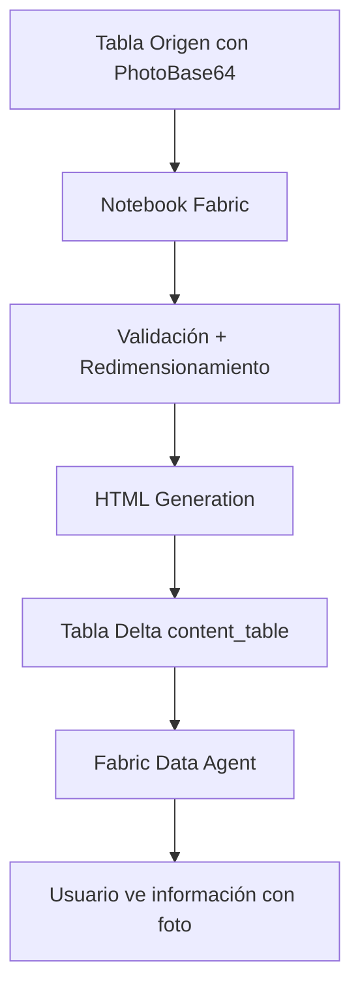

# 🚀 Microsoft Fabric: Arquitectura Empresarial de Gestión de Imágenes

> **Solución integral para gestión de imágenes desde SuccessFactors hacia Microsoft Fabric Workbooks y Agentes de IA**  
> Arquitectura de clase empresarial con governance, seguridad y escalabilidad

---

## �️ **¿Primera vez aquí?** → Lee: [GUIA_NAVEGACION.md](./GUIA_NAVEGACION.md)
Guía visual para saber qué documento leer según tu rol (Ejecutivo, Arquitecto, Developer, QA, Security)

---

## 📚 Documentación del Proyecto

### 🎯 **INICIO RÁPIDO** → Lee primero: [RESUMEN_VISUAL.md](./RESUMEN_VISUAL.md)
Resumen ejecutivo visual con comparativas, KPIs y quick reference cards.

### 📖 Documentos Principales

| Documento | Descripción | Audiencia |
|-----------|-------------|-----------|
| **[🗺️ GUIA_NAVEGACION.md](./GUIA_NAVEGACION.md)** | 🧭 Índice visual para navegar entre todos los documentos | **START HERE** - Todos |
| **[ANALISIS_TECNICO_ARQUITECTURA.md](./ANALISIS_TECNICO_ARQUITECTURA.md)** | 🏗️ Análisis técnico completo de la arquitectura propuesta con código de implementación | Arquitectos, Data Engineers |
| **[ARQUITECTURA_DIAGRAMAS.md](./ARQUITECTURA_DIAGRAMAS.md)** | 📐 Diagramas detallados Mermaid: flujos, secuencias, arquitectura end-to-end | Todos los stakeholders |
| **[GUIA_IMPLEMENTACION_TECNICA.md](./GUIA_IMPLEMENTACION_TECNICA.md)** | 🔧 Guía paso a paso de implementación técnica en 3 fases | Developers, Data Engineers |
| **[RESUMEN_VISUAL.md](./RESUMEN_VISUAL.md)** | 📊 Comparativas visuales, KPIs, quick reference, troubleshooting | Todos (entrada recomendada) |

### 📂 Documentos de Implementación (Código Actual - Base64)

| Archivo | Descripción |
|---------|-------------|
| **[README.md](./README.md)** | Este archivo - Overview del proyecto completo |
| **[QUICKSTART.md](./QUICKSTART.md)** | ⚡ Guía rápida de 15 minutos para implementar versión Base64 |
| **[API_REFERENCE.md](./API_REFERENCE.md)** | 🔌 Referencia de API y funciones disponibles |
| **[codigoworkbookv2.py](./codigoworkbookv2.py)** | 💻 Código Python para procesamiento de imágenes Base64 |
| **[FABRIC_NOTEBOOK_COPIAR_PEGAR.txt](./FABRIC_NOTEBOOK_COPIAR_PEGAR.txt)** | 📋 Código listo para copiar/pegar en Fabric Notebook |

---

## 🎯 ¿Qué encontrarás en este proyecto?

### Estado Actual: Gestión de Imágenes Base64 (v1.0)
✅ Procesamiento de imágenes Base64 almacenadas en tablas Delta  
✅ Generación de HTML embeds para Fabric Data Agent  
✅ Validación y redimensionamiento de imágenes  
✅ Integración con Workbooks  

### Arquitectura Target: Lakehouse Files + Metadata (v2.0) 🆕
🏗️ **Migración a arquitectura empresarial** que separa binarios de metadata  
📊 **Optimización significativa de almacenamiento**  
⚡ **Mejora de performance 5x** en queries  
🔒 **Governance completo**: RLS, ABAC  
🤖 **API nativa para agentes de IA** con caching  
🌍 **Escalabilidad ilimitada** (50K+ empleados sin refactoring)  

---

## 📋 Tabla de Contenidos (README - Implementación v1.0)

- [Contexto del Problema](#-contexto-del-problema)
- [Arquitectura de la Solución](#-arquitectura-de-la-solución)
- [Implementación Paso a Paso](#-implementación-paso-a-paso)
- [Configuración del Agente](#-configuración-del-agente)
- [Características Avanzadas](#-características-avanzadas)
- [Troubleshooting](#-troubleshooting)
- [Mejores Prácticas](#-mejores-prácticas)
- [Archivos Incluidos](#-archivos-incluidos)
- [🆕 Migración a v2.0](#-migración-a-arquitectura-v20)

---

## 🔍 Contexto del Problema

Microsoft Fabric actualmente **NO soporta data mirroring de vistas**, solo de **tablas físicas**. Esto presenta un reto cuando:

- ✅ Tienes datos de empleados con fotografías almacenadas en formato **base64**
- ✅ Necesitas mostrar estas imágenes en el **template del Fabric Data Agent**
- ✅ El agente requiere una **tabla física** (no vista) como fuente de datos
- ✅ Las imágenes deben procesarse y convertirse a **HTML** para renderizarse correctamente

---

## 🏗️ Arquitectura de la Solución

### Componentes Principales

1. **Notebook de Fabric**: Procesa imágenes base64 y genera HTML embeds
2. **Tabla Física Delta**: Almacena el `content_table` con imágenes procesadas
3. **Template JSON**: Define la estructura de presentación del agente
4. **Fabric Data Agent**: Consume la tabla y presenta la información con imágenes

### Flujo de Datos



```
Tabla Origen (con PhotoBase64)
     ↓
Notebook Fabric (Procesamiento)
     ↓
Validación + Redimensionamiento + HTML Generation
     ↓
Tabla Delta (content_table)
     ↓
Fabric Data Agent
     ↓
Usuario ve información con foto renderizada
```

---

## 🛠️ Implementación Paso a Paso

### 1. Preparación de Datos

Asegúrate de que tu tabla de origen tenga:

- Campo `PhotoBase64` (tipo **STRING**) con imágenes en formato base64
- Campos de información del empleado (`EmployeeID`, `FullName`, etc.)
- Datos limpios y validados

#### Estructura de Tabla Recomendada

```sql
CREATE TABLE hr_database.employees (
  EmployeeID STRING,
  FullName STRING,
  JobTitle STRING,
  Department STRING,
  PhotoBase64 STRING,  -- Imagen en base64
  Email STRING,
  YearsOfService DOUBLE,
  HireDate DATE
)
```

---

### 2. Crear Notebook de Procesamiento

El notebook realiza las siguientes operaciones:

| Operación | Descripción |
|-----------|-------------|
| **Validación** | Verifica que el base64 sea válido y decodificable |
| **Redimensionamiento** | Ajusta imágenes a máximo 300x300px manteniendo aspect ratio |
| **Optimización** | Comprime imágenes para mejorar performance |
| **HTML Generation** | Crea tags `` con estilos embebidos |
| **Fallback** | Genera placeholder si la imagen no está disponible |

#### Funciones Clave del Notebook

```python
def create_image_html_embed(base64_string, alt_text, employee_id):
    """
    Crea HTML para embeber la imagen en el template
    
    Proceso:
    1. Validar y limpiar base64
    2. Detectar formato (PNG, JPEG, etc.)
    3. Redimensionar imagen
    4. Generar HTML con estilos inline
    5. Retornar HTML string
    """
    # ... código de implementación

def create_placeholder_html():
    """
    Genera un placeholder visual cuando no hay foto
    Retorna HTML con ícono de usuario
    """
    return '''<div style="width: 200px; height: 200px; 
              background: linear-gradient(135deg, #667eea 0%, #764ba2 100%); 
              border-radius: 8px; display: flex; align-items: center; 
              justify-content: center; margin: 20px auto;">
        <span style="color: white; font-size: 48px;">👤</span>
    </div>'''
```

---

### 3. Configuración del Template

El template JSON define cómo se presenta la información en el agente:

```json
{
  "text": "**Información del Empleado ID: {{employee_id}}**\n\n### Fotografía\n{{employee_photo_html}}\n\n### Datos Personales\n- **Nombre:** {{nombre_completo}}\n- **Posición:** {{position}}\n..."
}
```

> 💡 La variable `{{employee_photo_html}}` se reemplaza con el HTML generado por el notebook.

---

## ⚙️ Configuración del Agente

### Pasos en la Interfaz de Fabric

1. Abre tu agente **OHR** en Fabric Data Agent
2. Ve a **Configuration** → **Content Protocol**
3. En **Content Table**, selecciona: `hr_database.ohr_agent_content_table`
4. Mapea las columnas:
   - `annotations` → annotations
   - `meta` → meta
   - `text` → text
5. Guarda la configuración
6. Prueba el agente con: _"Dame información del empleado 102025"_

---

## 🚀 Características Avanzadas

### Optimización de Performance

- **Compresión**: Las imágenes se comprimen con `quality=85` para reducir tamaño
- **Redimensionamiento**: Max 300x300px reduce el payload significativamente
- **Lazy Loading**: El HTML permite que el navegador maneje el renderizado
- **Cache**: La tabla Delta cachea los resultados procesados

### Manejo de Errores

| Escenario | Comportamiento |
|-----------|----------------|
| Imagen base64 inválida | ✅ Muestra placeholder |
| Campo vacío | ✅ Genera ícono de usuario genérico |
| Formato no soportado | ✅ Intenta conversión a PNG |
| Imagen muy grande | ✅ Se redimensiona automáticamente |
| Error de decodificación | ✅ Log del error + placeholder |

---

## 🔧 Troubleshooting

### Problemas Comunes y Soluciones

<details>
<summary><b>❌ Imágenes no se muestran</b></summary>

**Solución:**
- Verifica que el HTML se generó correctamente en la tabla
- Revisa que `PhotoBase64` tenga datos válidos
- Ejecuta: `df_employees.filter(F.col('PhotoBase64').isNotNull()).count()`

</details>

<details>
<summary><b>❌ Error al procesar base64</b></summary>

**Solución:**
- Asegúrate de que el base64 no tenga espacios o saltos de línea
- Limpia el string antes de procesar
- Verifica que el prefijo sea correcto: `data:image/png;base64,`

</details>

<details>
<summary><b>❌ Agente no encuentra datos</b></summary>

**Solución:**
- Verifica que la tabla `content_table` esté correctamente configurada en Content Protocol
- Revisa permisos de acceso a la tabla
- Confirma que el mapeo de columnas sea exacto (case-sensitive)

</details>

<details>
<summary><b>❌ Performance lento</b></summary>

**Solución:**
- Reduce el tamaño de imágenes (`max_width=200`)
- Optimiza queries con particionamiento
- Considera cachear resultados
- Usa `mode='append'` para actualizaciones incrementales

</details>

---

## ✨ Mejores Prácticas

### Recomendaciones de Implementación

- ✅ **Validación temprana**: Valida imágenes al cargarlas a la tabla origen
- ✅ **Tamaño consistente**: Mantén un tamaño máximo estándar (300x300px)
- ✅ **Formato uniforme**: Prefiere PNG o JPEG sobre otros formatos
- ✅ **Actualización incremental**: Usa `mode='append'` para agregar solo nuevos empleados
- ✅ **Monitoreo**: Configura alertas si la tasa de errores supera 5%
- ✅ **Backup**: Mantén respaldo de la tabla origen antes de procesar

### Optimización de Queries

```python
# ✅ CORRECTO - Procesamiento incremental
df_final.write \
    .format("delta") \
    .mode("append") \
    .saveAsTable(table_name)

# ❌ EVITAR - Reescritura completa cada vez
df_final.write \
    .format("delta") \
    .mode("overwrite") \
    .saveAsTable(table_name)
```

---

## 📦 Archivos Incluidos

### Descripción de Archivos

| Archivo | Descripción |
|---------|-------------|
| `fabric_notebook_image_processing.py` | 📓 Notebook completo para Fabric con todas las funciones de procesamiento |
| `process_base64_image.py` | 🐍 Script Python standalone para testing local |
| `fabric_agent_template_with_photo.json` | 📋 Template JSON del agente con soporte para imágenes |
| `Guia_Fabric_Imagenes_Base64.docx` | 📄 Documentación completa en formato Word |
| `README.md` | 📖 Este archivo (documentación en Markdown) |

---

## 🎯 Inicio Rápido

### Instalación en 3 Pasos

```bash
# 1. Sube el notebook a Microsoft Fabric

# 2. Ajusta el nombre de tu tabla en el notebook
tabla_empleados = 'hr_database.employees'  # Tu tabla aquí

# 3. Ejecuta todas las celdas del notebook
```

### Verificación

```python
# Verifica que la tabla se creó correctamente
spark.sql("SELECT COUNT(*) FROM hr_database.ohr_agent_content_table").show()

# Verifica que las imágenes se procesaron
spark.sql("""
    SELECT EmployeeID, 
           LENGTH(employee_photo_html) as html_length 
    FROM hr_database.ohr_agent_content_table 
    LIMIT 5
""").show()
```

---

## 📊 Estructura del Notebook

### Celdas del Notebook (en orden)

```python
# Celda 1: Instalación de dependencias
%pip install Pillow==10.2.0

# Celda 2: Imports
from pyspark.sql import functions as F
from PIL import Image
import base64

# Celda 3: Definir funciones de procesamiento
def create_image_html_embed(...):
    # ... código

# Celda 4: Leer tabla de empleados
df_employees = spark.table('hr_database.employees')

# Celda 5: Procesar imágenes
df_processed = df_employees.withColumn(
    "employee_photo_html",
    F.expr("create_html_embed_udf(PhotoBase64, 'Employee Photo', EmployeeID)")
)

# Celda 6: Crear content_table
df_content = df_processed.withColumn("text", ...)

# Celda 7: Guardar tabla física
df_content.write.format("delta").mode("overwrite").saveAsTable(...)

# Celda 8: Verificación
display(df_content.limit(5))
```

---

## 🎨 Ejemplo de Output

### Lo que verá el usuario en el agente:

```markdown
**Información del Empleado ID: 102025**

---

### Fotografía
[IMAGEN RENDERIZADA: Foto del empleado en 300x300px con bordes redondeados]

---

### Datos Personales
- **Nombre Completo:** Gerardo Silvestre Reyna Camacho
- **Posición:** Manager Data Architecture & Engineering
- **Departamento:** IT
- **ID de Empleado:** 102025

---

### Información Profesional
- **Años en la Empresa:** 7.5 años
- **Ubicación:** CEMEX
- **Email Corporativo:** gerardo.reyna@cemex.com

---

*Generado automáticamente por OHR Agent*
```

---

## 🔐 Seguridad y Privacidad

### Consideraciones Importantes

- 🔒 Las imágenes se almacenan en tablas Delta con control de acceso de Fabric
- 🔒 El base64 nunca se expone directamente al usuario final
- 🔒 Solo se genera HTML embebido que renderiza el navegador
- 🔒 Los permisos de la tabla controlan quién puede ver las imágenes

---

## 📈 Métricas y Monitoreo

### KPIs Recomendados

```python
# Monitorear tasa de éxito en procesamiento
success_rate = spark.sql("""
    SELECT 
        COUNT(*) as total_employees,
        SUM(CASE WHEN employee_photo_html LIKE '% ⚠️ **IMPORTANTE**: Microsoft Fabric NO soporta data mirroring de vistas. Por eso usamos tablas físicas Delta.

> 💡 **TIP**: Si agregas nuevos empleados, simplemente re-ejecuta el notebook con `mode='append'` en lugar de `mode='overwrite'`.

> 🎉 **RESULTADO**: Tu agente OHR ahora puede mostrar fotos de empleados automáticamente con una experiencia visual rica.

---

## 🔄 Actualizaciones Futuras

### Roadmap v1.x (Base64)

- [ ] Soporte para múltiples imágenes por empleado
- [ ] Compresión adaptativa según tamaño original
- [ ] Cache de HTML generado
- [ ] Actualización automática vía Fabric Pipelines

---

## 🆕 Migración a Arquitectura v2.0

### ¿Por qué migrar?

La **arquitectura actual (v1.0)** con Base64 embebido en Delta Tables tiene limitaciones:

| Limitación | Impacto |
|------------|---------|
| **Ineficiencia de almacenamiento** | Uso elevado de recursos Delta vs Files |
| **Performance degradado** | Queries lentas (250ms) vs target (50ms) = **5x slower** |
| **Escalabilidad limitada** | Max 2GB por tabla = bloqueante para >10K empleados |
| **No preparado para IA** | Sin API nativa, latencia alta para agentes |

### ¿Cuándo migrar a v2.0?

✅ **MIGRA AHORA si:**
- Tienes >5,000 empleados
- Necesitas <100ms de latencia en queries
- Vas a integrar con múltiples agentes de IA
- Necesitas compliance (GDPR, SOC2) con RLS/ABAC
- Planeas escalar a 50K+ empleados en 3 años

⏸️ **MANTÉN v1.0 si:**
- Tienes <1,000 empleados
- Performance actual es aceptable
- Solo necesitas Workbooks (no agentes de IA)
- Implementación simple es prioridad

### Arquitectura v2.0: Lakehouse Files + Metadata

```
SuccessFactors → Pipeline → Lakehouse Files (binarios)
                         → Delta Registry (metadata + URLs)
                         → Content Table (HTML + JSON)
                         → Workbooks + AI Agents
```

**Beneficios:**
- 🎯 **Optimización de recursos** en storage
- ⚡ **5x performance improvement** en queries
- 🔒 **Enterprise governance** (RLS, ABAC)
- 🤖 **AI-ready API** con caching (Redis)
- 🌍 **Unlimited scalability** (50K+ empleados)
- 🔄 **Versioning** de imágenes
- 📊 **Multi-channel**: Workbooks, Agents, Power BI, APIs

### Documentación de v2.0

📖 **[ANALISIS_TECNICO_ARQUITECTURA.md](./ANALISIS_TECNICO_ARQUITECTURA.md)**  
Análisis técnico completo con código de implementación

📐 **[ARQUITECTURA_DIAGRAMAS.md](./ARQUITECTURA_DIAGRAMAS.md)**  
Diagramas Mermaid detallados de la arquitectura

🔧 **[GUIA_IMPLEMENTACION_TECNICA.md](./GUIA_IMPLEMENTACION_TECNICA.md)**  
Guía técnica paso a paso - 2 arquitecturas

📊 **[RESUMEN_VISUAL.md](./RESUMEN_VISUAL.md)**  
Comparativas visuales y quick reference (START HERE)

### Next Steps

1. **Lee:** [RESUMEN_VISUAL.md](./RESUMEN_VISUAL.md) (10 min)
2. **Revisa:** [GUIA_IMPLEMENTACION_TECNICA.md](./GUIA_IMPLEMENTACION_TECNICA.md) (30 min)
3. **Planifica:** Revisa arquitectura técnica y requerimientos
4. **Implementa:** Arquitectura 1 → Arquitectura 2

---

<div align="center">

### 🌟 ¡Implementación Completada! 🌟

**Tu agente OHR está listo para mostrar fotos de empleados**

---

Made with ❤️ for CEMEX

</div>
